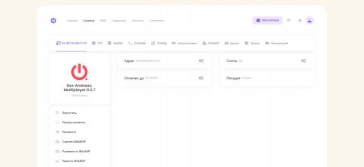
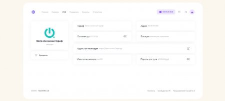
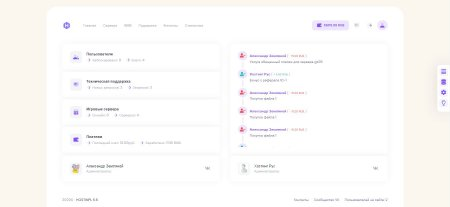

<p align="center">
  <strong>HOSTINPL 5.6</strong><br>
  Billing &amp; control panel for game and web hosting
</p>

<p align="center">
  <a href="https://github.com/iteffa-works/hostinpl.pl">GitHub</a> ·
  <a href=".docs/README.md">Documentation</a> ·
  <a href="CHANGELOG.md">Changelog</a> ·
  <a href="ROADMAP.md">Roadmap</a> ·
  <a href="CONTRIBUTING.md">Contributing</a> ·
  <a href="https://flowaxy.com/donate">Donate</a>
</p>

<p align="center">
  
  
  
  
</p>

---

HOSTINPL is a production-ready PHP panel for selling and managing **game servers** (SAMP, MTA, Minecraft, Counter-Strike, RAGE:MP, and more), **web hosting**, **payments**, **support tickets**, and **remote locations** — from a single admin interface.

> **Free product.** Originally created by HOSTINPL (HOSTING-RUS).  
> **Further development and maintenance:** [FLOWAXY DIGITAL STUDIO](https://flowaxy.com) — forever free, open on GitHub.

---

## Table of contents

- [Features](#features)
- [Screenshots](#screenshots)
- [Quick start](#quick-start)
- [Requirements](#requirements)
- [What is not in this repository](#what-is-not-in-this-repository)
- [Documentation](#documentation)
- [Project stewardship](#project-stewardship)
- [Contributing & security](#contributing--security)
- [Support & donate](#support--donate)
- [License](#license)

---

## Features

| Area | Capabilities |
|------|----------------|
| **Game servers** | SAMP, CRMP, MTA, Minecraft / MCPE, CS 1.6 / Source / GO, RAGE:MP, Unit |
| **Infrastructure** | Multi-location, Docker runtime, FastDL (Nginx), Pure-FTPd, SSH |
| **Panel** | Billing, admin, task scheduler, file repository, live stats |
| **Payments** | FreeKassa, Robokassa, Unitpay, QIWI P2P, YooMoney, Enot, Anipay, LiteKassa |
| **Support** | Real-time tickets, online support status, VK login |
| **Web hosting** | Dedicated module with server health checks |

---

## Screenshots

| User panel | Administration | Game servers |
|:--:|:--:|:--:|
|  |  |  |

Gallery: [`.screenshots/`](.screenshots/)

---

## Quick start

### Panel + installer (Debian 11 / 12 / 13, `root`)

```bash
apt-get update -y && apt-get install wget -y
wget --inet4-only --no-check-certificate \
  "https://code.flowaxy.com/hostpanel/install56_deb.sh" -O install56_deb.sh
chmod +x install56_deb.sh && bash install56_deb.sh
```

| Menu | Action |
|------|--------|
| **1** | Install web panel only |
| **2** | Install game location only |
| **3** | Panel + location on one server (not recommended) |
| **4** | Download game packs to existing location |
| **5** | Add swap file |

**Panel** is cloned from this repository into `/var/www/`  
**Install assets** (configs, games, Docker image) are fetched from `https://code.flowaxy.com/hostpanel`

[Full installation guide](.docs/installation.md)

### Location-only (reboot required)

```bash
apt-get update -y && apt-get install wget apparmor -y && rm -f install56_deb.sh
reboot
```

After reboot, run the installer command again.

### Local development

```bash
git clone https://github.com/iteffa-works/hostinpl.pl.git
cp application/config.example.php application/config.php
# Import hostinpl5_6.sql, configure web server — see .docs/development.md
```

---

## Requirements

| Component | Version |
|-----------|---------|
| OS | Debian 11 / 12 / 13 |
| PHP | 7.4 (D11) · 8.2 (D12) · 8.4 (D13) |
| Database | MariaDB |
| Panel | Apache 2 + `mod_php` |
| Location | Nginx + PHP-FPM + Docker |
| PHP extensions | `mysql`, `ssh2`, `mbstring`; `short_open_tag=On` |
| RAM | ≥ 400 MB (locations need more) |

Debian 9 is unsupported. Mixed Debian versions (panel ≠ location) will not work.

---

## What is not in this repository

Large install binaries are **not** stored in Git (~2.6 GB). They are hosted on the CDN:

| Asset | CDN path |
|-------|----------|
| Docker game image (~924 MB) | `l/docker_images/debian_bullseye_hostinpl_02062024.tar` |
| Game archives (SAMP, MTA, CS, etc.) | `l/g/*.zip` |

See [install/README.md](install/README.md) and [.docs/hosting-assets.md](.docs/hosting-assets.md).

---

## Documentation

| Document | Description |
|----------|-------------|
| [.docs/README.md](.docs/README.md) | Documentation index |
| [Installation](.docs/installation.md) | Setup guide |
| [Hosting install assets](.docs/hosting-assets.md) | CDN mirror layout |
| [Architecture](.docs/architecture.md) | MVC, routing, models |
| [Configuration](.docs/configuration.md) | `config.example.php`, games |
| [Payments](.docs/payments.md) | Gateway callbacks |
| [Cron jobs](.docs/cron.md) | Scheduled tasks |
| [Security](.docs/security.md) | Hardening guide |
| [Troubleshooting](.docs/troubleshooting.md) | Common issues |
| [Development](.docs/development.md) | Local dev & contributing |
| [About](.docs/about.md) | FLOWAXY & project history |
| [Changelog](CHANGELOG.md) | Release history |
| [Roadmap](ROADMAP.md) | Planned updates |
| [AGENTS.md](AGENTS.md) | AI agent context |

---

## Project stewardship

| | |
|---|---|
| **Original authors** | Samir Shelenko, Alexander Zemlyanoy — HOSTINPL (HOSTING-RUS), 2020 |
| **Current maintainer** | **[FLOWAXY DIGITAL STUDIO](https://flowaxy.com)** |
| **License** | Free / open — see [LICENSE](LICENSE) |
| **Repository** | [github.com/iteffa-works/hostinpl.pl](https://github.com/iteffa-works/hostinpl.pl) |
| **Install CDN** | [code.flowaxy.com/hostpanel](https://code.flowaxy.com/hostpanel) |

FLOWAXY continues HOSTINPL as a **free product** for the hosting community. See [ROADMAP.md](ROADMAP.md).

---

## Contributing & security

- [CONTRIBUTING.md](CONTRIBUTING.md) — how to submit changes
- [SECURITY.md](SECURITY.md) — vulnerability reporting
- [GitHub Issues](https://github.com/iteffa-works/hostinpl.pl/issues) — bugs and features

---

## Support & donate

- **Issues:** [github.com/iteffa-works/hostinpl.pl/issues](https://github.com/iteffa-works/hostinpl.pl/issues)
- **Donate:** [flowaxy.com/donate](https://flowaxy.com/donate)

---

## License

Copyright (c) 2020 HOSTINPL — Samir Shelenko, Alexander Zemlyanoy  
Copyright (c) 2026 FLOWAXY DIGITAL STUDIO

Free software, provided **as is**. Full text: [LICENSE](LICENSE).
